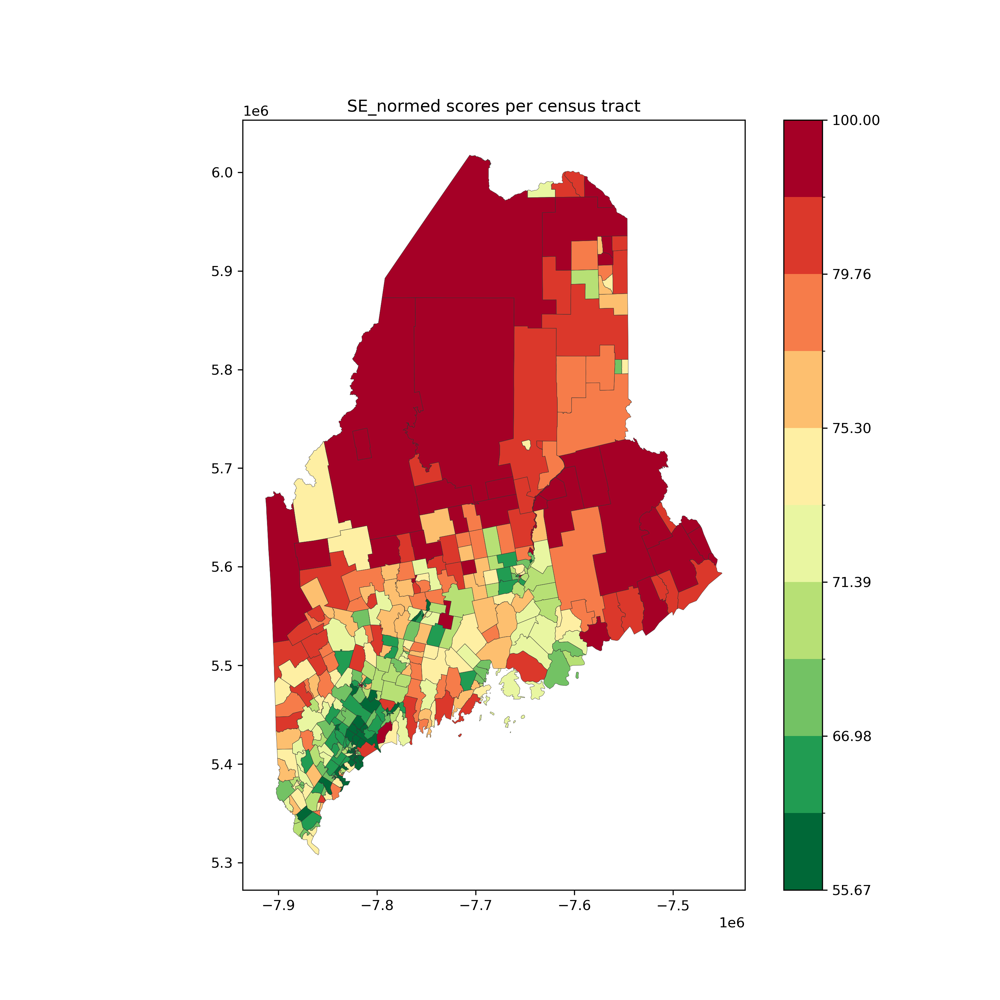

# project-spring24： MCA

## Team members
1.TaoYuan(lead)
github username:hueyyt
2.Qian Yin
github username:PennyY1103
3.Sihan Bai
github username:hanasu061

## Data Collection / Resources
According to the [Purdue's 2021 Digital Divide Index](https://storymaps.arcgis.com/stories/8ad45c48ba5c43d8ad36240ff0ea0dc7), we need two parts: INFA and SE.
INFA data comes from the [FCC broadband data collection](https://www.fcc.gov/BroadbandData).

SE data comes from the [American Community Survey 5-Year Data (2009-2022)](https://www.census.gov/data/developers/data-sets/acs-5year.html).
We used detailed tables, subject tables, data profiles and comparsion profiles.
Detailed Tables contain the most detailed cross-tabulations, many of which are published down to block groups. The data are population counts.
Subject Tables provide an overview of the estimates available in a particular topic.  The data are presented as population counts and percentages. 
Maine's number in the table: 23
* Persons who are 60 years of age or older
  ** Subject tables: S0101_C01_028E
  ** Estimate!!Total!!Total population!!SELECTED AGE CATEGORIES!!60 years and over

* Incarcerated individuals
  ** Used 2022 State Data in [Digital Equity Act of 2021 (census.gov)](https://www.census.gov/programs-surveys/community-resilience-estimates/partnerships/ntia/digital-equity.html).
  ** It has total population of Maine state and percentage of incarcerated population.
  ** estimated incarcerated population in Maine = state_tot_pop * pct_incarc_pop
  ** proportion = num of people in each tract / total population in Maine
  ** estimated incarcerated population in each tract = estimated incarcerated population in Maine * proportion

* Veterans
  ** Detailed table: B21001_002E
  ** Estimate!!Total:!!Veteran

* Persons with disabilities
  ** Subject table: S1810_C02_001E
  ** Estimate!!Total!!Total civilian noninstitutionalized population	Disability Characteristics

* Members of a racial or ethnic minority group
  ** Data profiles: ['DP05_0072E', 'DP05_0073E', 'DP05_0080E', 'DP05_0081E', 'DP05_0082E', 'DP05_0083E', 'DP05_0084E', 'DP05_0085E']
  _(def)_ The population who identify as a race other than White alone or as Hispanic or Latino of any
    race

    Below is an overview of the population data about members of a racial or ethnic minority group.

* Rural residents
    _(def)_ The rural population, as defined by the Digital Equity Act of 2021, is the population living
    outside of cities and towns with more than 20,000 residents or living outside larger cities and
    towns with more than 50,000 residents and their surrounding urban areas.

    Below is an overview of the population data about rural residents in 2020 Demographic and Housing Characteristics Table. 

* Individuals with a language barrier, including those who are English learners or have low literacy levels
  ** Detailed table: B06007_005M, B06007_008E
  ** B06007_005M: Margin of Error!!Total:!!Speak Spanish:!!Speak English less than "very well"
  ** B06007_008E: Estimate!!Total:!!Speak other languages:!!Speak English less than "very well"
  _(def)_ English learners or have low literacy levels. English learners are defined as individuals who
    speak a language other than English at home and speak English less than “very well.”

    Below is an overview of the population data about individuals with a language barrier.

* Individuals living in households with incomes not exceeding 150 percent of the poverty level
  ** Subject table: S1701_C01_040E
  ** Estimate!!Total!!Population for whom poverty status is determined!!ALL INDIVIDUALS WITH INCOME BELOW THE FOLLOWING POVERTY RATIOS!!150 percent of poverty level
    _(def)_ Households with income no more than 150 percent of the federal poverty threshold.
    Below is an overview of the population data about individuals with incomes not exceeding 150 percent of the poverty level.


## Implement
In order to print the INFA results, use command:
```
make -f data
```
This will download data.
```
make -f speed
```
This is for calculate average downlaod and upload speed
```
make -f population
```
For calculate percentage of populaiton can't access to network or compute device.
```
make -f INFA
```
To calculate INFA 
```
make -f maps
```
To combine INFA and geo data and make maps by geo id.


In order to print the SE results, use command:
```
make SE 
```

## Results
INFA MAP:

This is a test map for using code and visualize data, not final version. Since we found several different equations and data. 
From the fig of INFA, we can find that some tracts don't have data. In the middle, there are eight tracts have good performence. The worst tracts are in the north and east.

SE MAP:

In the SE results, the south parts where are close to Portland and have more population have good performence. They have more younger and well-educated people. Middle close to south tracts where are close to the sea have better performence than in the west. In the east tracts, the performence is not very well. The worst part is the north tracts close to the west. 

## Challenge
* Incarcerated individuals
  ** The data cannot be find directly in the American Community Survey. In the census.gov, after choosing Population and People -> Counts, Estimates, and Projections -> Group Quarters Population -> B26103 Group Quarters Type(3 types), we can get Adult correctional facilities which is 3350. It's a estimated data and we cannot get the data of each tract.
  ** In the [National Institute Corrections](https://nicic.gov/resources/nic-library/state-statistics/2021/maine-2021), we can get the corrections state statistics information of Maine in 2021. 
  ** In the National Institute Correction, Prison Population: 1,473, Jail Population: 1,411, Parole Population: 17, Probation Population: 5,303.
  ** The data in NIC and census.gov excludes Federal facilities.
  ** The number of incarcerated people in Maine and each tract is estimated.

* Rural
  ** Rural residents data is incomplete because rural residents data (2018-2022) can not be found. [H2 Urban and Rural Table](https://data.census.gov/table/DECENNIALDHC2020.H2?q=rural&g=040XX00US23$1400000) might be added but it only contains data in 2020. 
