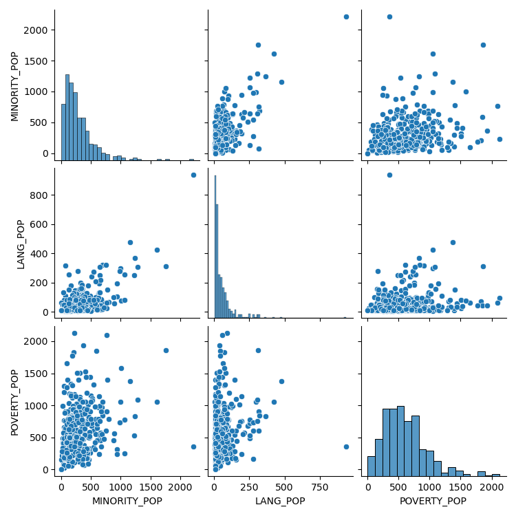

# EDA - The covered populations (last four groups)

This document is about the last four covered populations defined by the Digital Equity Act of 2021.
- Members of a racial or ethnic minority group
- Rural residents
- Individuals with a language barrier, including those who are English learners or have low literacy levels
- Individuals living in households with incomes not exceeding 150 percent of the poverty level

To check the data about the last four covered populations and the distribution figure, the following command is required. 
```
make -f Makefile3 SE_last_4
```

The following table is an overview of the last four covered populations.
```
The covered populations - last four groups
Number of unique ID: 407
<class 'pandas.core.frame.DataFrame'>
RangeIndex: 407 entries, 0 to 406
Data columns (total 5 columns):
 #   Column        Non-Null Count  Dtype
---  ------        --------------  -----
 0   TOTAL_POP     407 non-null    int64
 1   MINORITY_POP  407 non-null    int64
 2   ID            407 non-null    object
 3   LANG_POP      407 non-null    int64
 4   POVERTY_POP   407 non-null    int64
dtypes: int64(4), object(1)
memory usage: 16.0+ KB
None
0  TOTAL_POP  MINORITY_POP           ID  LANG_POP  POVERTY_POP
0       1538           197  23001010100       101          777
1       5149           186  23001010200        62          667
2       2554           407  23001010300        60          515
3       2245           191  23001010400        53          371
4       2295           339  23001010500        80          657
```

Below is the distribution. 


## Discussion
- 

## Future work
- Rural residents data is incomplete.
- Individuals with low literacy levels are not included. 
- Data need to be saved as .csv file after collecting all necessary data. 