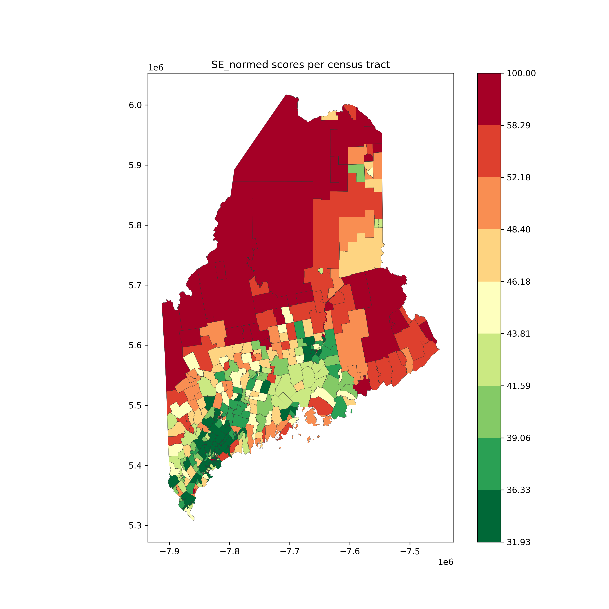
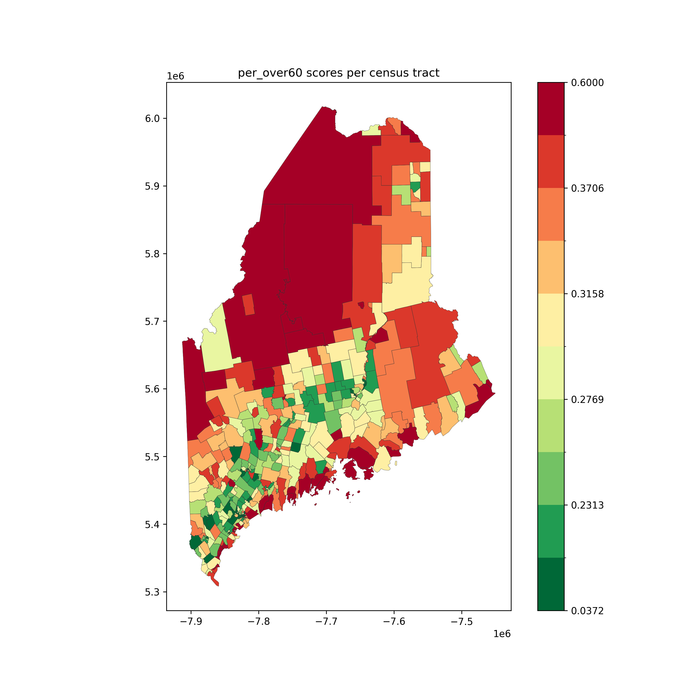
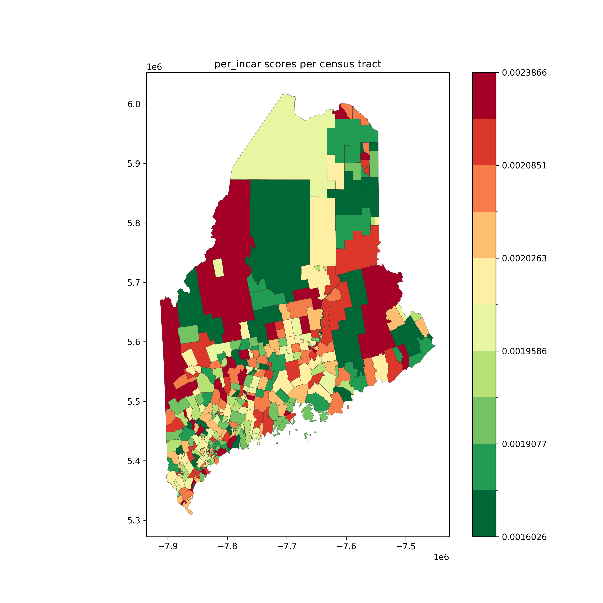
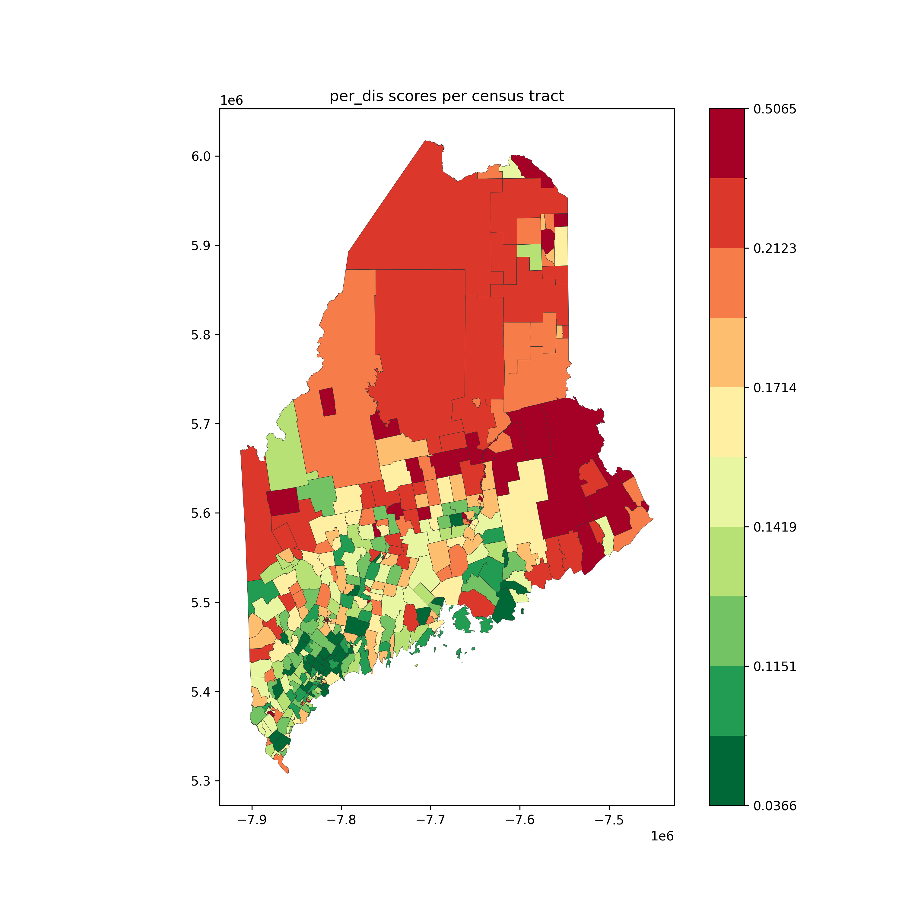
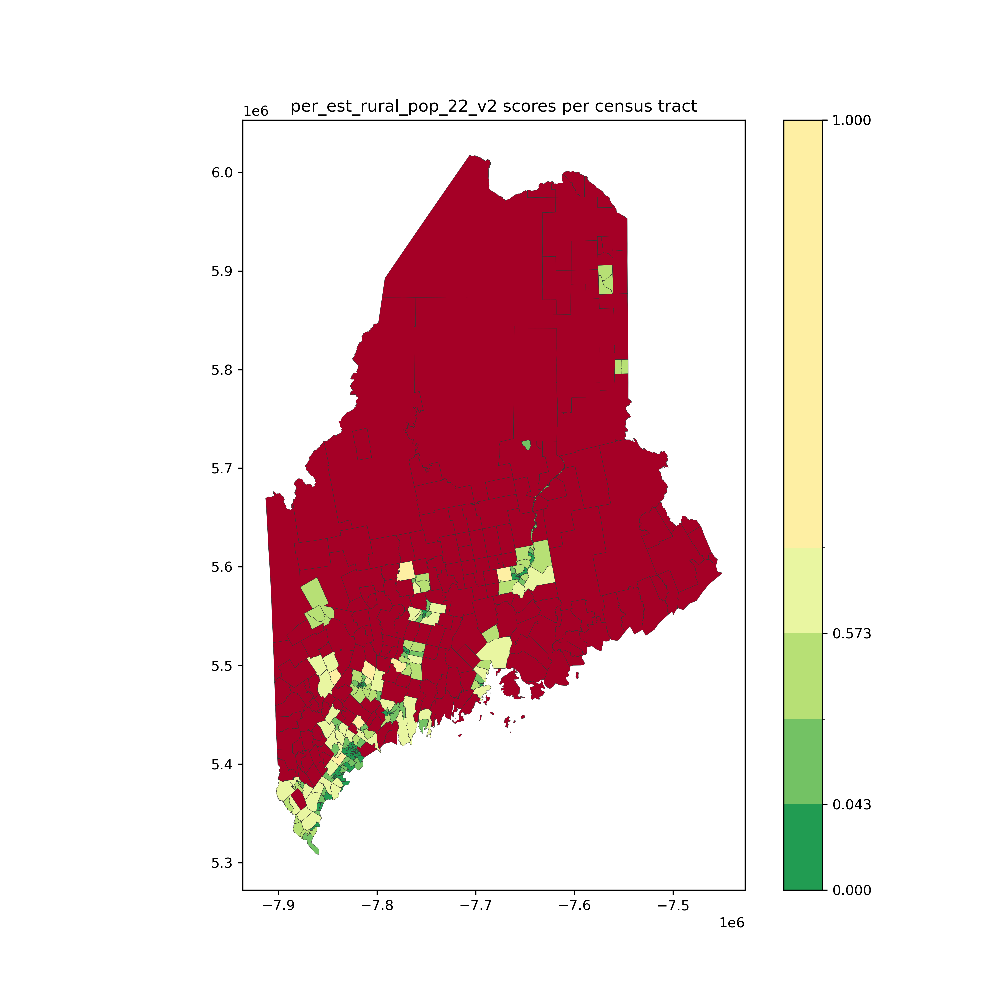
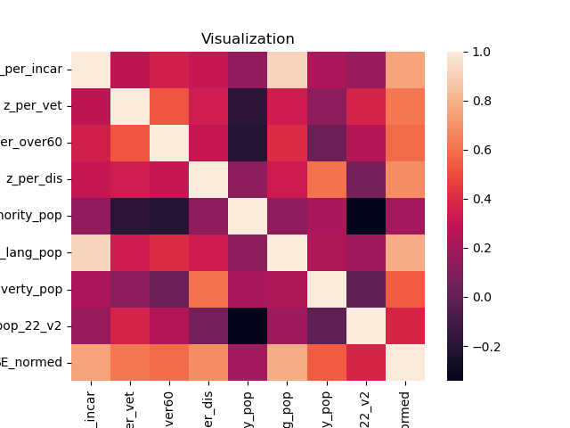

# 2022 Digital Divide Index
In this project, we calculated 2022 Digital Divide Index for Maine and visualized DDI based on the newly defined "covered populations" in the [Digital Equity Act of 2021](https://www.census.gov/programs-surveys/community-resilience-estimates/partnerships/ntia/digital-equity.html).

The Digital Divide Index consists of two scores, the infrastructure/adoption (INFA) score and the socioeconomic (SE) score. 

## Result
### INFA part

### SE part
The SE score consists of eight variables that are the percentages of eight "covered populations" defined in the Digital Equity Act of 2021.

The eight "covered populations" includes:
- Persons who are 60 years of age or older;
- Incarcerated individuals;
- Veterans;
- Persons with disabilities;
- Members of a racial or ethnic minority group;
- Rural residents;
- Individuals with a language barrier, including those who are English learners or have low literacy levels;
- Individuals living in households with incomes not exceeding 150 percent of the poverty level.

#### SE
Below are the top 5 areas with the highest SE scores. 
```
      SE_normed                                       loc
288  100.000000       Census Tract 9400, Penobscot County
13    99.281702  Census Tract 204.01, Androscoggin County
14    97.544519  Census Tract 204.02, Androscoggin County
334   95.841617      Census Tract 9551, Washington County
307   93.260229     Census Tract 9653.02, Somerset County
```
The visualization is attached below.


#### Persons who are 60 years of age or older
Below are the top 5 areas with the largest number of persons who are 60 years of age or older.
```
     over60  SE_normed                                loc
328    3543  79.358979     Census Tract 430, Waldo County
404    2630  74.315276   Census Tract 380.01, York County
201    2200  68.255892     Census Tract 9702, Knox County
403    2160  70.544997      Census Tract 370, York County
215    2093  79.483056  Census Tract 9752, Lincoln County
```

The visualization is attached below.


#### Incarcerated individuals
Below are the top 5 areas with the largest number of incarcerated individuals.
```
     estimated_incar  SE_normed                                    loc
250               16  66.164332      Census Tract 20, Penobscot County
94                16  65.425313  Census Tract 40.02, Cumberland County
115               15  64.946698    Census Tract 115, Cumberland County
31                14  70.469866  Census Tract 465, Androscoggin County
403               14  70.544997          Census Tract 370, York County
```

The visualization is attached below.


#### Veterans
Below are the top 5 areas with the largest number of veterans.
```
     vet  SE_normed                                    loc
26   747  82.553505  Census Tract 420, Androscoggin County
94   666  65.425313  Census Tract 40.02, Cumberland County
218  653  77.936749      Census Tract 9755, Lincoln County
367  636  76.898055       Census Tract 245.01, York County
177  623  75.943838      Census Tract 110, Kennebec County
```

The visualization is attached below.


#### Persons with disabilities
Below are the top 5 areas with the largest number of persons with disabilities.
```
      dis  SE_normed                                    loc
249  1756  70.592152       Census Tract 9, Penobscot County
404  1450  74.315276       Census Tract 380.01, York County
328  1347  79.358979         Census Tract 430, Waldo County
327  1243  76.040201         Census Tract 420, Waldo County
31   1212  70.469866  Census Tract 465, Androscoggin County
```

The visualization is attached below.


#### Members of a racial or ethnic minority group
Below are the top 5 areas with the largest number of members of a racial or ethnic minority group.
```
     minority_pop  SE_normed                                       loc
85           2212  71.784540     Census Tract 30.02, Cumberland County
13           1755  99.281702  Census Tract 204.01, Androscoggin County
72           1609  68.078702     Census Tract 21.02, Cumberland County
285          1285  74.166010        Census Tract 311, Penobscot County
80           1240  66.340088        Census Tract 27, Cumberland County
```

The visualization is attached below.


#### Rural residents
Below are the top 5 areas with the largest number of rural residents.
```
     est_rural_pop_22_v2  SE_normed                                  loc
115                 7305  64.946698  Census Tract 115, Cumberland County
262                 6555  71.361721    Census Tract 90, Penobscot County
218                 6471  77.936749    Census Tract 9755, Lincoln County
327                 6451  76.040201       Census Tract 420, Waldo County
263                 6448  64.133240   Census Tract 100, Penobscot County
```

The visualization is attached below.


#### Individuals with a language barrier
Below are the top 5 areas with the largest number of individuals with a language barrier.
```
     estimated_lang  SE_normed                                    loc
94              813  65.425313  Census Tract 40.02, Cumberland County
250             805  66.164332      Census Tract 20, Penobscot County
115             758  64.946698    Census Tract 115, Cumberland County
249             748  70.592152       Census Tract 9, Penobscot County
95              738  66.813837     Census Tract 41, Cumberland County
```

The visualization is attached below.


#### Individuals living in households with incomes not exceeding 150 percent of the poverty level
Below are the top 5 areas with the largest number of individuals living in households with incomes not exceeding 150 percent of the poverty level.
```
     poverty_pop  SE_normed                                       loc
196         2127  76.180647      Census Tract 241.02, Kennebec County
249         2091  70.592152          Census Tract 9, Penobscot County
256         1930  69.714125         Census Tract 61, Penobscot County
13          1860  99.281702  Census Tract 204.01, Androscoggin County
238         1848  81.332101          Census Tract 9665, Oxford County
```

The visualization is attached below.


#### Furthur Analysis
Based on the observation of the top 5 areas lists, we saw some areas shown in several lists. Therefore, we planed to analyze the overlapping parts in the lists. 

To check the result of the analysis, the following commanded is executed.
```
make SE_analysis
```

The command prints out the overlapping parts in the lists and also visualizes the potential correlations between these eight covered populations.
```
Top 5 Comparison
------------------------------------------
3 common locations between Incarcerated and Language

Top 10 Comparison
------------------------------------------
10 common locations between Incarcerated and Language
------------------------------------------
5 common locations between Disabled and Poverty

Top 20 Comparison
------------------------------------------
10 common locations between Over 60 and Incarcerated
------------------------------------------
10 common locations between Over 60 and Veterans
------------------------------------------
11 common locations between Over 60 and Language
------------------------------------------
10 common locations between Incarcerated and Rural
------------------------------------------
17 common locations between Incarcerated and Language
------------------------------------------
10 common locations between Disabled and Poverty
------------------------------------------
10 common locations between Rural and Language

Top 50 Comparison
------------------------------------------
28 common locations between Over 60 and Incarcerated
------------------------------------------
28 common locations between Over 60 and Veterans
------------------------------------------
26 common locations between Over 60 and Rural
------------------------------------------
30 common locations between Over 60 and Language
------------------------------------------
30 common locations between Incarcerated and Rural
------------------------------------------
42 common locations between Incarcerated and Language
------------------------------------------
26 common locations between Disabled and Poverty
------------------------------------------
27 common locations between Rural and Language
```



### DDI

## Next Step


