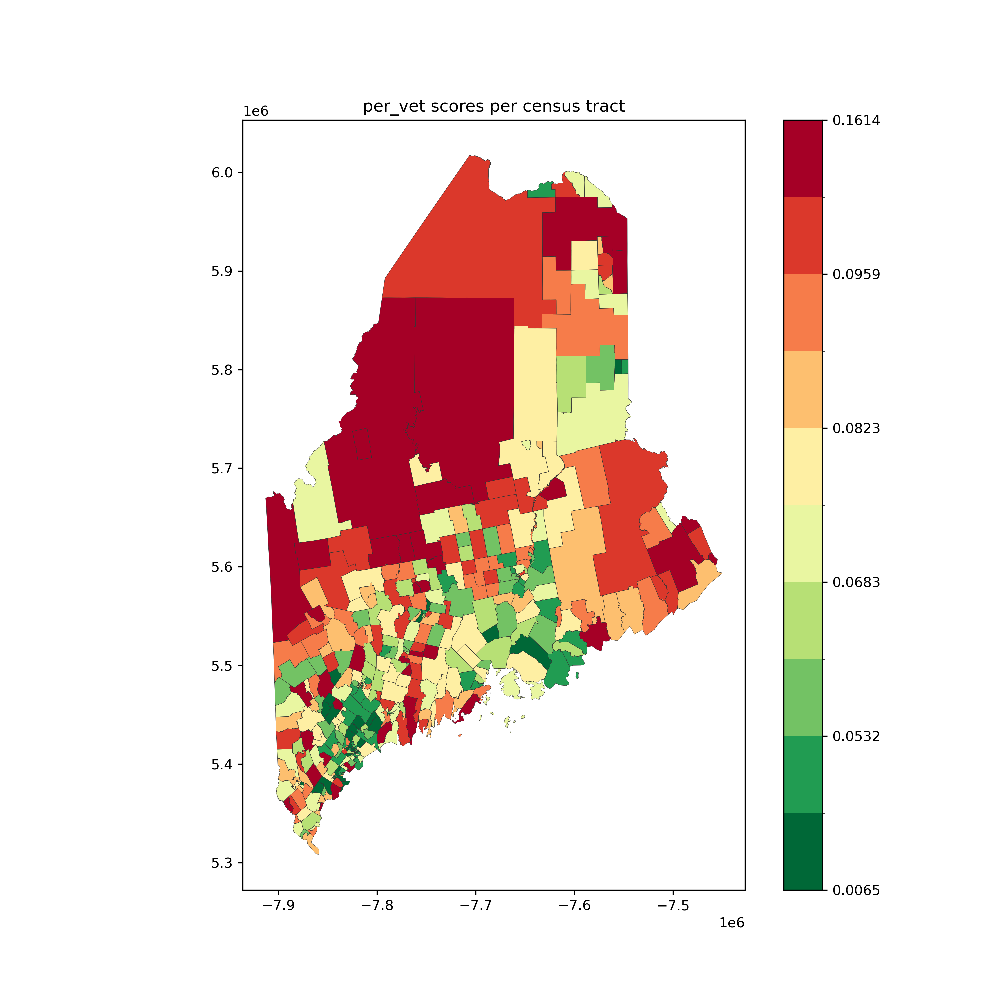

# 2022 Digital Divide Index
In this project, we calculated 2022 Digital Divide Index for Maine and visualized DDI based on the newly defined "covered populations" in the [Digital Equity Act of 2021](https://www.census.gov/programs-surveys/community-resilience-estimates/partnerships/ntia/digital-equity.html). 

The Digital Divide Index consists of two scores, the infrastructure/adoption (INFA) score and the socioeconomic (SE) score. 

**Note**: area and census tract are used interchangably in this result reprot. 

## Result

### DDI part
According to [2022 Digital Divide Index (DDI)](https://storymaps.arcgis.com/stories/8ad45c48ba5c43d8ad36240ff0ea0dc7) posted by Purdue University, the DDI score measures physical access/adoption and socioeconomic characteristics that may limit motivation, skills, and usage. A higher DDI indicates a higher digital divide.

Below are the top 5 areas with the highest DDI scores. 
```
              id  DDI_scaled
0    23001010100  100.000000
14   23001020402   93.863754
8    23001020100   90.144678
189  23011021000   84.787493
327  23027046002   84.110428
```
- Most of the ids are shown in the top 5 areas with the highest INFA scores. However, only one of the ids is shown in the top 5 areas with the highest SE scores. 

Below is the map illustrating DDI scores.


### INFA part
The INFA score consists of four variables related to broadband infrastructure and adoption. 

The four variables includes:
- percent of homes without a computing device (desktops, laptops, smartphones, tablets, etc.)
- percent of homes with no internet access (have no internet subscription, including cellular data plans or dial-up)
- average download
- average upload speeds in Megabits per second (Mbps) weighted by number of speed tests based Ookla Speedtest® open dataset

Below are the top 5 areas with the highest INFA scores. 
```
              id  INFA_scaled
0    23001010100   100.000000
359  23027046002    95.514704
221  23011021000    89.753659
86   23003952700    86.056359
16   23001020100    85.309379
```
- None of these ids is shown in the top 5 areas with the highest SE scores. It seems that SE score distribution and INFA score distribution might be very different. To verify our assumption, we can compare the INFA map and SE map.

Below is the INFA score map. 


- In this figure, areas with red color have higher INFA scores while areas with green color have lower INFA scores. A higher INFA score indicates that more broadband infrastructure need to be improved. 
- Areas close to the coast have relatively lower INFA scores. 


### SE part
The SE score consists of eight variables that are the percentages of eight "covered populations" defined in the Digital Equity Act of 2021.

The eight "covered populations" includes:
- Persons who are 60 years of age or older;
- Incarcerated individuals;
- Veterans;
- Persons with disabilities;
- Members of a racial or ethnic minority group;
- Rural residents;
- Individuals with a language barrier, including those who are English learners or have low literacy levels;
- Individuals living in households with incomes not exceeding 150 percent of the poverty level.

#### SE
Below are the top 5 areas with the highest SE scores. 
```
       SE_normed                                       loc           id
288  100.000000       Census Tract 9400, Penobscot County  23019940000
13    99.281702  Census Tract 204.01, Androscoggin County  23001020401
14    97.544519  Census Tract 204.02, Androscoggin County  23001020402
334   95.841617      Census Tract 9551, Washington County  23029955100
307   93.260229     Census Tract 9653.02, Somerset County  23025965302
```

The SE score visualization is attached below.


- In this figure, areas close to the coast have relatively lower SE scores. 

#### Persons who are 60 years of age or older
Below are the top 5 areas with the largest number of persons who are 60 years of age or older.
```
     over60  SE_normed                                loc           id
328    3543  79.358979     Census Tract 430, Waldo County  23027043000
404    2630  74.315276   Census Tract 380.01, York County  23031038001
201    2200  68.255892     Census Tract 9702, Knox County  23013970200
403    2160  70.544997      Census Tract 370, York County  23031037000
215    2093  79.483056  Census Tract 9752, Lincoln County  23015975200
```

The visualization is attached below.


#### Incarcerated individuals
Below are the top 5 areas with the largest number of incarcerated individuals.
```
     estimated_incar  SE_normed                                    loc           id
250               16  66.164332      Census Tract 20, Penobscot County  23019002000
94                16  65.425313  Census Tract 40.02, Cumberland County  23005004002
115               15  64.946698    Census Tract 115, Cumberland County  23005011500
31                14  70.469866  Census Tract 465, Androscoggin County  23001046500
403               14  70.544997          Census Tract 370, York County  23031037000
```

The visualization is attached below.


#### Veterans
Below are the top 5 areas with the largest number of veterans.
```
Veterans
     vet  SE_normed                                    loc           id
26   747  82.553505  Census Tract 420, Androscoggin County  23001042000
94   666  65.425313  Census Tract 40.02, Cumberland County  23005004002
218  653  77.936749      Census Tract 9755, Lincoln County  23015975500
367  636  76.898055       Census Tract 245.01, York County  23031024501
177  623  75.943838      Census Tract 110, Kennebec County  23011011000
```

The visualization is attached below.


#### Persons with disabilities
Below are the top 5 areas with the largest number of persons with disabilities.
```
      dis  SE_normed                                    loc           id
249  1756  70.592152       Census Tract 9, Penobscot County  23019000900
404  1450  74.315276       Census Tract 380.01, York County  23031038001
328  1347  79.358979         Census Tract 430, Waldo County  23027043000
327  1243  76.040201         Census Tract 420, Waldo County  23027042000
31   1212  70.469866  Census Tract 465, Androscoggin County  23001046500
```

The visualization is attached below.


#### Members of a racial or ethnic minority group
Below are the top 5 areas with the largest number of members of a racial or ethnic minority group.
```
     minority_pop  SE_normed                                       loc           id
85           2212  71.784540     Census Tract 30.02, Cumberland County  23005003002
13           1755  99.281702  Census Tract 204.01, Androscoggin County  23001020401
72           1609  68.078702     Census Tract 21.02, Cumberland County  23005002102
285          1285  74.166010        Census Tract 311, Penobscot County  23019031100
80           1240  66.340088        Census Tract 27, Cumberland County  23005002700
```

The visualization is attached below.


#### Rural residents
Below are the top 5 areas with the largest number of rural residents.
```
     est_rural_pop_22_v2  SE_normed                                  loc           id
115                 7305  64.946698  Census Tract 115, Cumberland County  23005011500
262                 6555  71.361721    Census Tract 90, Penobscot County  23019009000
218                 6471  77.936749    Census Tract 9755, Lincoln County  23015975500
327                 6451  76.040201       Census Tract 420, Waldo County  23027042000
263                 6448  64.133240   Census Tract 100, Penobscot County  23019010000
```

The visualization is attached below.


#### Individuals with a language barrier
Below are the top 5 areas with the largest number of individuals with a language barrier.
```
     estimated_lang  SE_normed                                    loc           id
94              813  65.425313  Census Tract 40.02, Cumberland County  23005004002
250             805  66.164332      Census Tract 20, Penobscot County  23019002000
115             758  64.946698    Census Tract 115, Cumberland County  23005011500
249             748  70.592152       Census Tract 9, Penobscot County  23019000900
95              738  66.813837     Census Tract 41, Cumberland County  23005004100
```

The visualization is attached below.


#### Individuals living in households with incomes not exceeding 150 percent of the poverty level
Below are the top 5 areas with the largest number of individuals living in households with incomes not exceeding 150 percent of the poverty level.
```
     poverty_pop  SE_normed                                       loc           id
196         2127  76.180647      Census Tract 241.02, Kennebec County  23011024102
249         2091  70.592152          Census Tract 9, Penobscot County  23019000900
256         1930  69.714125         Census Tract 61, Penobscot County  23019006100
13          1860  99.281702  Census Tract 204.01, Androscoggin County  23001020401
238         1848  81.332101          Census Tract 9665, Oxford County  23017966500
```

The visualization is attached below.


## Furthur Analysis

### Visualization
- DDI vs. INFA vs. SE
     - The DDI map and INFA map have more similar distributions. 
- Eight Covered populations
     - 

### Top N area list comparison
Based on the observation of the top 5 areas lists, we saw some areas shown in several lists. Therefore, we planed to analyze the overlapping parts in the lists. 

To check the result of the analysis, the following commanded is executed.
```
make SE_analysis
```

The command prints out the overlapping parts in the lists when the number of overlapping elements is greater than half of the length of the list. 
```
Top 5 Comparison
------------------------------------------
3 common locations between Incarcerated and Language

Top 10 Comparison
------------------------------------------
10 common locations between Incarcerated and Language
------------------------------------------
5 common locations between Disabled and Poverty

Top 20 Comparison
------------------------------------------
10 common locations between Over 60 and Incarcerated
------------------------------------------
10 common locations between Over 60 and Veterans
------------------------------------------
11 common locations between Over 60 and Language
------------------------------------------
10 common locations between Incarcerated and Rural
------------------------------------------
17 common locations between Incarcerated and Language
------------------------------------------
10 common locations between Disabled and Poverty
------------------------------------------
10 common locations between Rural and Language

Top 50 Comparison
------------------------------------------
28 common locations between Over 60 and Incarcerated
------------------------------------------
28 common locations between Over 60 and Veterans
------------------------------------------
26 common locations between Over 60 and Rural
------------------------------------------
30 common locations between Over 60 and Language
------------------------------------------
30 common locations between Incarcerated and Rural
------------------------------------------
42 common locations between Incarcerated and Language
------------------------------------------
26 common locations between Disabled and Poverty
------------------------------------------
27 common locations between Rural and Language
```

- The common locations between Incarcerated and Language are shown in top 5/10/20/50 list comparisons. The major reason might be that we used the same technique to estimate incarcerated populations and language barrier populations.
- The pair `Disabled and Poverty` is shown in top 10/20/50 list comparisons. 

### DDI

## Next Step
- Based on the overlap, we can furthur analyze the most affected areas and potential correlations between eight covered populations. 
- To ensure that the fund and resource are allocated effectively, it's important to understand the specific issue in each area. For example, a high SE score doesn't tell us what kind of help is more important in this area. 


